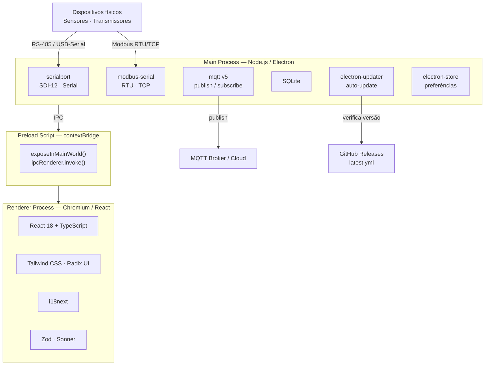
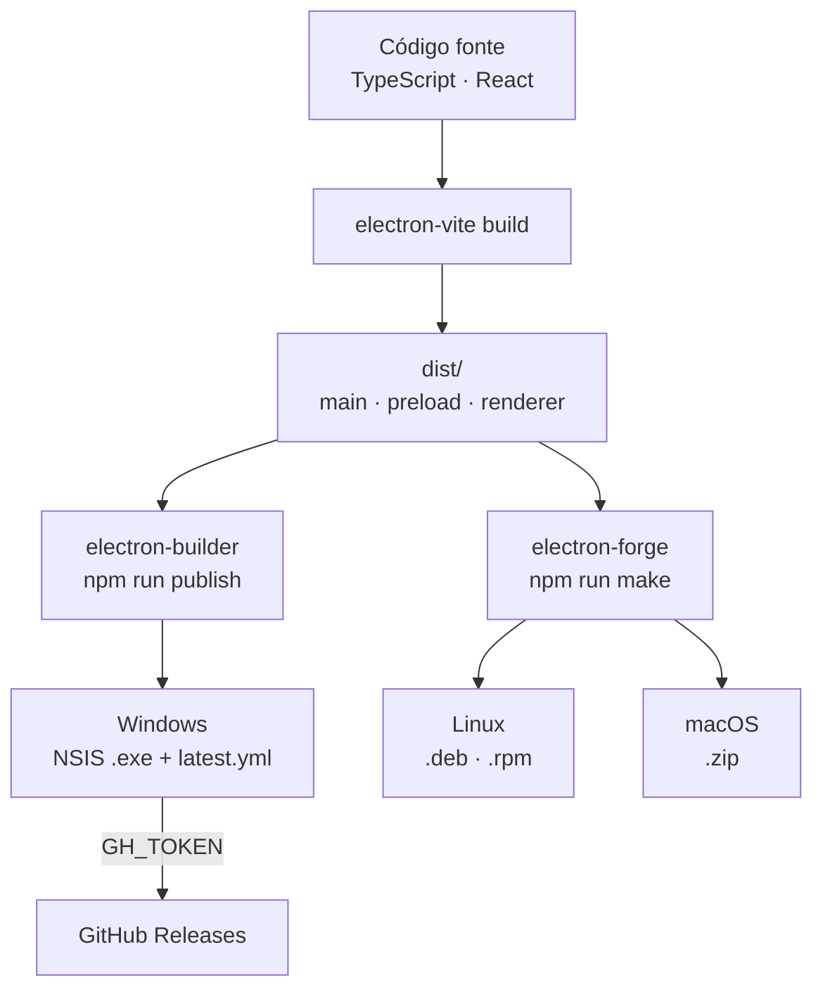

# Suite Device App

**Versão:** 2.3.1  
**Autor:** Dualbase / [DhioneCastilhoBarbosa](https://github.com/DhioneCastilhoBarbosa)  
**Repositório:** https://github.com/DhioneCastilhoBarbosa/suite-device-app

---

## Visão geral

O **Suite Device** é uma aplicação desktop instalável desenvolvida com Electron que permite configurar e se comunicar com sensores ambientais e transmissores de dados remotos. O software atua como bridge entre o sistema operacional do usuário e dispositivos físicos de campo (sensores, dataloggers e transmissores), utilizando protocolos industriais padrão.

### Propósito principal

- Configurar sensores ambientais via interface gráfica
- Comunicar-se com transmissores de dados remotos
- Armazenar e exportar leituras de dispositivos
- Publicar dados via MQTT para integração com plataformas IoT

### Protocolos suportados

- **SDI-12** — sensores ambientais digitais
- **Modbus** — RTU (serial) e TCP (rede)
- **Serial** — comunicação genérica (RS-232 / USB)
- **MQTT** — publicação para brokers IoT

---

## Requisitos

- **Node.js** 18+ (recomendado LTS)
- **npm** 9+
- **Windows:** Visual Studio Build Tools (para módulos nativos como `serialport`, `better-sqlite3`)
- **Git** (clone do repositório)

---

## Instalação, execução e compilação

### 1. Instalar dependências

Clone o repositório e instale os pacotes (o `postinstall` aplica patches via `patch-package`):

```bash
git clone https://github.com/DhioneCastilhoBarbosa/suite-device-app.git
cd suite-device-app
npm install
```

Se houver erro em módulos nativos após mudança de versão do Electron/Node:

```bash
npm run rebuild
```

### 2. Rodar em desenvolvimento

Inicia a aplicação com hot reload (main, preload e renderer):

```bash
npm run dev
```

Outros comandos úteis em desenvolvimento:

```bash
npm run typecheck    # Verifica TypeScript (main + renderer)
npm run lint         # ESLint com correção automática
npm run format       # Prettier em todo o projeto
npm run start        # Preview da build (electron-vite preview)
```

### 3. Compilar (build de produção)

Compila TypeScript, empacota com electron-vite e copia recursos:

```bash
npm run build
```

Build completo para Windows (ícone + build + electron-builder):

```bash
npm run build:win
```

Build por plataforma (após `npm run build` implícito no script):

```bash
npm run build:mac
npm run build:linux
```

### 4. Gerar instaladores (distribuição local)

Gera instaladores na pasta `out/` via **Electron Forge** (ex.: `Suite-Device.exe` no Windows). **Não** gera `latest.yml` — não serve para auto-update:

```bash
npm run make
```

Variantes Forge:

```bash
npm run make-linux
npm run make-deb
npm run make-rpm
npm run publish-forge   # Publica via Electron Forge (GitHub)
```

### 5. Publicar com atualização automática (Windows)

O `electron-updater` exige release no GitHub com artefatos do **electron-builder** (NSIS + `latest.yml` + `.blockmap`), não os instaladores Squirrel do Forge.

1. Crie um arquivo `.env` na raiz com `GH_TOKEN` (escopo `repo` no GitHub).
2. Execute:

```bash
npm run publish
```

No release devem aparecer ficheiros como `latest.yml` e `suite-device-app Setup X.Y.Z.exe`. O instalador NSIS instala em `%LocalAppData%\Programs\...`.

Gerar apenas o ícone Windows:

```bash
npm run icons:generate
```

---

## Scripts disponíveis

| Comando | Descrição |
|---------|-----------|
| `npm install` | Instala dependências e aplica patches (`patch-package`) |
| `npm run dev` | Desenvolvimento com hot reload |
| `npm run build` | Typecheck + compilação electron-vite + cópia de resources |
| `npm run build:win` | Ícone + build + empacotamento Windows (electron-builder) |
| `npm run build:mac` | Build + empacotamento macOS |
| `npm run build:linux` | Build + empacotamento Linux |
| `npm run make` | Build + instaladores na pasta `out/` (Electron Forge) |
| `npm run publish` | Build Windows + publicação no GitHub Releases (auto-update) |
| `npm run publish-forge` | Publicação via Electron Forge |
| `npm run typecheck` | Verificação TypeScript (node + web) |
| `npm run lint` | ESLint |
| `npm run format` | Prettier |
| `npm run rebuild` | Recompila módulos nativos (`better-sqlite3`, etc.) |
| `npm run icons:generate` | Gera ícone `.ico` para Windows |

---

## Stack tecnológica

| Camada | Tecnologia | Versão |
|--------|-----------|--------|
| Runtime desktop | Electron | ^25.9.8 |
| Framework UI | React | ^18.2.0 |
| Linguagem | TypeScript | ^5.1.6 |
| Bundler | electron-vite | ^1.0.29 |
| Empacotamento | Electron Forge + Electron Builder | ^7.3.0 / ^24.6.3 |
| Estilização | Tailwind CSS | ^3.3.5 |
| Banco de dados | SQLite (sqlite3) | — |
| Serialização | CBOR-X | ^1.6.4 |
| Validação | Zod | ^3.23.8 |
| Notificações | react-toastify + sonner | — |
| Ícones | @phosphor-icons/react | ^2.0.15 |
| i18n | i18next + react-i18next | ^25.5.2 |

**Tecnologias principais:** React · TypeScript · Electron · electron-vite · Tailwind CSS

---

## Arquitetura do sistema

O Suite Device segue a arquitetura padrão do Electron, dividida em três processos isolados:



### Comunicação IPC

```
Renderer → preload.contextBridge.exposeInMainWorld()
         → ipcRenderer.invoke('canal')
         → ipcMain.handle('canal', handler)
         → Resposta assíncrona
```

---

## Estrutura de diretórios

```
suite-device-app/
├── src/
│   ├── main/              # Processo principal do Electron
│   │   └── index.ts       # Entry point do main process
│   ├── preload/           # Scripts de bridge (preload)
│   └── renderer/          # Interface React
│       └── src/
│           ├── components/ # Componentes reutilizáveis
│           ├── Context/    # Contextos React
│           ├── locales/    # Traduções (via src/locales na raiz)
│           └── assets/     # Recursos estáticos
├── src/locales/           # en / es (PT como chave padrão)
├── resources/             # Ícones, recursos nativos
├── scripts/               # Build e utilitários
│   ├── generate-icon.cjs
│   ├── build-win.cjs
│   └── publish-win.cjs
├── patches/               # Patches de dependências (patch-package)
├── electron-builder.yml   # Empacotamento e publicação
├── electron.vite.config.ts
├── forge.config.js
├── tailwind.config.js
├── tsconfig.json
├── tsconfig.node.json     # main / preload
└── tsconfig.web.json      # renderer
```

---

## Camadas da aplicação

### Main Process (`src/main/`)

Lógica com acesso privilegiado ao sistema operacional:

- **Serial:** `serialport`, baud configurável, parsers readline e byte-length
- **Modbus:** `modbus-serial` (RTU e TCP)
- **SDI-12:** protocolo sobre serial com lógica customizada
- **MQTT:** cliente v5, QoS e credenciais configuráveis
- **SQLite:** persistência local (apenas no main)
- **Electron Store:** preferências do usuário
- **Auto-update:** `electron-updater` + GitHub Releases

### Preload (`src/preload/`)

- `contextBridge.exposeInMainWorld()` — APIs seguras ao renderer
- `@electron-toolkit/preload`
- Não expõe Node.js diretamente ao renderer

### Renderer (`src/renderer/`)

- React 18 + TypeScript
- Radix UI, Tailwind CSS, Phosphor Icons
- i18next (PT, EN, ES)
- Zod, react-toastify, sonner

---

## Protocolos de comunicação

### SDI-12

- Half-duplex, 1200 baud
- Endereçamento: 0–9, a–z, A–Z
- Comandos: Identify (`I!`), Measure (`M!`), Data (`D0!`), etc.

### Modbus

- **RTU** (RS-485/RS-232) e **TCP** (IP)
- Holding/input registers, coils
- Biblioteca: `modbus-serial`

### Serial

- Baud, paridade, data/stop bits configuráveis
- Parsers: readline, byte-length
- CBOR-X para payloads binários (ex.: mcumgr no PluviDB-IoT)

### MQTT

- Publicação para brokers externos
- QoS 0, 1, 2

---

## Banco de dados

- **SQLite** embarcado, arquivo `suite-device.db` em desenvolvimento
- Acesso **somente** pelo main process
- Uso: configurações de dispositivos, leituras e parâmetros de conexão
- Exportação via `file-saver`

---

## Build e distribuição

### Fluxo de build



### Targets

| Plataforma | Formato | Ferramenta |
|-----------|---------|-----------|
| Windows | NSIS Installer (.exe) | electron-builder |
| Linux | .deb / .rpm | electron-forge |
| macOS | .zip | electron-forge |

### NSIS (Windows)

- Assistente passo a passo (`oneClick: false`)
- Instalação por usuário (`perMachine: false`)
- Atalhos na área de trabalho e Menu Iniciar
- Instalação padrão: `%LocalAppData%\Programs\`

---

## Dependências principais

| Pacote | Finalidade |
|--------|-----------|
| `serialport` | Comunicação serial |
| `modbus-serial` | Modbus RTU/TCP |
| `mqtt` | Cliente MQTT v5 |
| `sqlite3` | Banco local |
| `electron-store` | Preferências |
| `electron-updater` | Atualização automática |
| `i18next` | Internacionalização |
| `zod` | Validação |
| `cbor-x` | Serialização CBOR |
| `file-saver` | Exportação de arquivos |

---

## Fluxo de dados

```
Dispositivo físico (sensor / transmissor)
        │
        │  RS-485 / RS-232 / USB-Serial
        ▼
  Porta serial do SO
        │
  [Main Process] serialport / modbus-serial
        │
        ├── Parser → decodificação → SQLite
        ├── IPC → Renderer → UI em tempo real
        └── MQTT → broker → cloud / dashboard
```

---

## Internacionalização

- `i18next` + `react-i18next`
- Idiomas: **pt** (padrão), **en**, **es**
- Arquivos: `src/locales/en/translation.json`, `src/locales/es/translation.json`
- Detecção automática via `i18next-browser-languagedetector` e `localStorage`

---

## Atualização automática

- Releases com `npm run publish` geram `latest.yml` + instalador NSIS + `.blockmap`
- `electron-updater` verifica novas versões ao iniciar
- Configuração em `electron-builder.yml`:

```yaml
publish:
  provider: github
  owner: DhioneCastilhoBarbosa
  repo: suite-device-app
  releaseType: release
  vPrefixedTagName: true
```

---

## Considerações de segurança

- Renderer **sem** `nodeIntegration` — sem Node.js direto na UI
- Hardware e banco acessados apenas pelo main process via IPC
- Preload expõe somente APIs necessárias via `contextBridge`
- Banco local não exposto à rede

---

## Dispositivos suportados (interface)

Entre outros, a aplicação inclui interfaces dedicadas para:

- PluviDB-IoT (serial, login, firmware via mcumgr em modo recovery)
- TSatDB, Teclado SDI-12, LinnimDB (Cap / Borbulha)
- Modbus (configuração e atualização de firmware)

---

*Documentação baseada no repositório [suite-device-app](https://github.com/DhioneCastilhoBarbosa/suite-device-app).*
