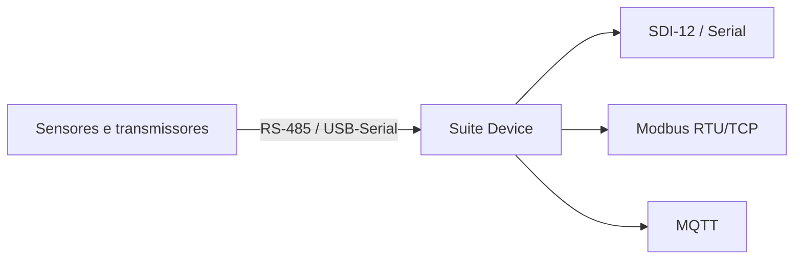
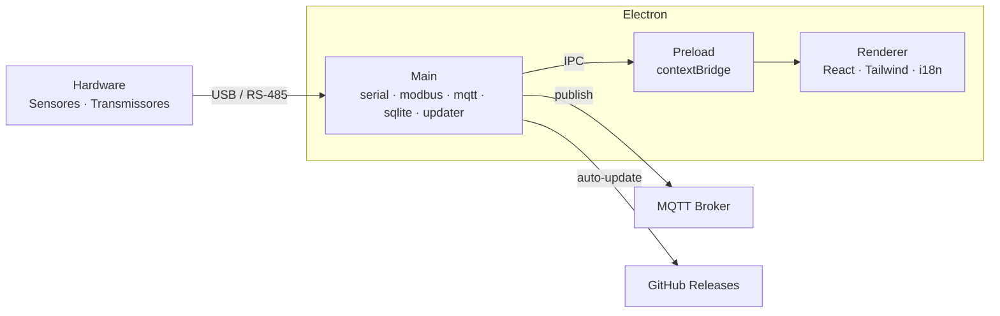
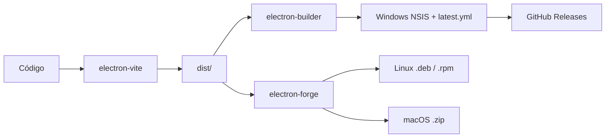

<div align="center">

# Suite Device

### Plataforma desktop para configuração e comunicação com dispositivos Dualbase

[](https://github.com/DhioneCastilhoBarbosa/suite-device-app/releases)
[](https://www.electronjs.org/)
[](https://react.dev/)
[](https://www.typescriptlang.org/)
[](#)

**Configure sensores · Comunique-se com transmissores · Publique dados via MQTT**

[Início rápido](#início-rápido) · [Dispositivos](#dispositivos-suportados) · [Protocolos](#protocolos) · [Arquitetura](#arquitetura) · [Build](#build--distribuição)

</div>

---

## Visão geral

O **Suite Device** é uma aplicação desktop instalável que conecta o computador a sensores ambientais, dataloggers e transmissores de campo. Desenvolvido pela **Dualbase**, funciona como bridge entre o sistema operacional e o hardware — com interface gráfica, persistência local e integração IoT.

| Capacidade | Descrição |
|:---|:---|
| **Configuração** | Ajuste parâmetros, endereços e unidades via UI dedicada por produto |
| **Comunicação** | SDI-12, Modbus RTU/TCP, Serial e MQTT |
| **Firmware** | Atualização de dispositivos (ex.: PluviDB-IoT via mcumgr) |
| **Dados** | Armazenamento local (SQLite) e exportação de leituras/logs |
| **Idiomas** | Português, Inglês e Espanhol |

---

## Dispositivos suportados

Interfaces modulares para a linha Dualbase:

| Dispositivo | Função |
|:---|:---|
| **Terminal-SDI12** | Terminal transparente e atalhos para sensores SDI-12 |
| **LimniDB-Borbulha** | Sensor de nível por borbulhamento |
| **LimniDB-CAP** | Sensor de nível capacitivo |
| **Teclado-SDI12** | Configuração de variáveis e comandos SDI-12 |
| **TSatDB** | Transmissor satelital (GPS, RF, apontamento de antena) |
| **PluviDB-IoT** | Pluviômetro IoT (local e remoto, firmware, MQTT) |
| **Modbus** | Configuração e atualização de firmware Modbus |

---

## Protocolos



| Protocolo | Uso |
|:---|:---|
| **SDI-12** | Sensores digitais ambientais (`I!`, `M!`, `D0!`, …) — half-duplex, 1200 baud |
| **Modbus** | RTU (serial) e TCP (rede) — holding/input registers, coils |
| **Serial** | RS-232 / USB genérico; payloads CBOR (mcumgr) |
| **MQTT** | Publicação para brokers e plataformas IoT (QoS 0/1/2) |

---

## Stack

| Camada | Tecnologia |
|:---|:---|
| Desktop | Electron 25 · electron-vite · Electron Forge / Builder |
| UI | React 18 · TypeScript · Tailwind CSS · Radix UI · Phosphor Icons |
| Hardware | `serialport` · `modbus-serial` · `mqtt` · `cbor-x` |
| Dados | SQLite · electron-store · Zod · file-saver |
| i18n | i18next · react-i18next (PT · EN · ES) |
| Updates | electron-updater + GitHub Releases |

---

## Início rápido

### Requisitos

- **Node.js** 18+ (LTS recomendado)
- **npm** 9+
- **Windows:** Visual Studio Build Tools (módulos nativos: `serialport`, `sqlite3`)
- **Git**

### Instalação

```bash
git clone https://github.com/DhioneCastilhoBarbosa/suite-device-app.git
cd suite-device-app
npm install
```

> O `postinstall` aplica patches via `patch-package`. Se módulos nativos falharem após troca de Node/Electron:

```bash
npm run rebuild
```

### Desenvolvimento

```bash
npm run dev          # hot reload (main + preload + renderer)
npm run typecheck    # TypeScript
npm run lint         # ESLint
npm run format       # Prettier
```

---

## Scripts

| Comando | O que faz |
|:---|:---|
| `npm run dev` | App em modo desenvolvimento |
| `npm run build` | Typecheck + electron-vite + cópia de `resources/` |
| `npm run build:win` | Ícone + build + pacote Windows (NSIS) |
| `npm run build:mac` | Build + pacote macOS |
| `npm run build:linux` | Build + pacote Linux |
| `npm run make` | Instaladores locais via Electron Forge (`out/`) |
| `npm run publish` | Publica release Windows no GitHub (auto-update) |
| `npm run icons:generate` | Gera `.ico` para Windows |
| `npm run rebuild` | Recompila addons nativos |

---

## Arquitetura

Arquitetura clássica Electron com isolamento de privilégios:



| Processo | Responsabilidade |
|:---|:---|
| **Main** | Serial, Modbus, SDI-12, MQTT, SQLite, preferências, auto-update |
| **Preload** | Expõe APIs seguras via `contextBridge` (sem Node no renderer) |
| **Renderer** | Interface React, validação Zod, toasts, i18n |

**IPC:** `Renderer → invoke → ipcMain.handle → resposta assíncrona`

---

## Estrutura do projeto

```text
suite-device-app/
├── src/
│   ├── main/                 # Processo principal Electron
│   ├── preload/              # Bridge segura (contextBridge)
│   ├── renderer/src/         # UI React
│   │   ├── components/       # Telas e widgets por dispositivo
│   │   ├── Context/          # Estado global (DeviceContext)
│   │   └── utils/            # Serial, Modbus, MQTT, firmware
│   ├── locales/              # Traduções en / es (PT = chave padrão)
│   └── db/                   # Camada SQLite
├── resources/                # Ícones, binários auxiliares (PluviDB-Updater)
├── scripts/                  # build-win, publish-win, generate-icon
├── patches/                  # patch-package
├── electron-builder.yml
├── electron.vite.config.ts
└── forge.config.js
```

---

## Build & distribuição



| Plataforma | Formato | Ferramenta |
|:---|:---|:---|
| Windows | NSIS `.exe` + `latest.yml` | electron-builder |
| Linux | `.deb` / `.rpm` | electron-forge |
| macOS | `.zip` | electron-forge |

### Publicar com auto-update (Windows)

O `electron-updater` exige artefatos do **electron-builder** (não os do Forge).

1. Crie `.env` na raiz com `GH_TOKEN` (escopo `repo`)
2. Execute:

```bash
npm run publish
```

No release devem aparecer `latest.yml`, o instalador NSIS e o `.blockmap`.  
Instalação padrão: `%LocalAppData%\Programs\` · atalho **Suite Device**.

---

## Banco de dados & segurança

- **SQLite** local (`suite-device.db` em desenvolvimento) — acesso só pelo main process
- Preferências com **electron-store**
- Renderer **sem** `nodeIntegration`; hardware e DB apenas via IPC
- Preload expõe somente as APIs necessárias

---

## Internacionalização

| Idioma | Código |
|:---|:---|
| Português | `pt` (padrão — chaves) |
| English | `en` → `src/locales/en/` |
| Español | `es` → `src/locales/es/` |

Detecção automática com `i18next-browser-languagedetector` e persistência em `localStorage`.

---

## Links

- **Autor:** Dualbase / [Dhione Castilho Barbosa](https://github.com/DhioneCastilhoBarbosa)
- **Site:** [dhionecastilho.com.br](https://www.dhionecastilho.com.br)
- **Repositório:** [suite-device-app](https://github.com/DhioneCastilhoBarbosa/suite-device-app)
- **Releases:** [GitHub Releases](https://github.com/DhioneCastilhoBarbosa/suite-device-app/releases)

---

<div align="center">

**Suite Device** · Dualbase  
*Configure. Conecte. Monitore.*

</div>
